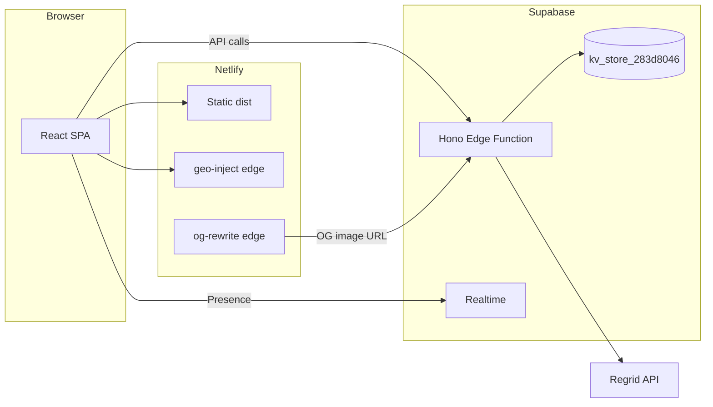
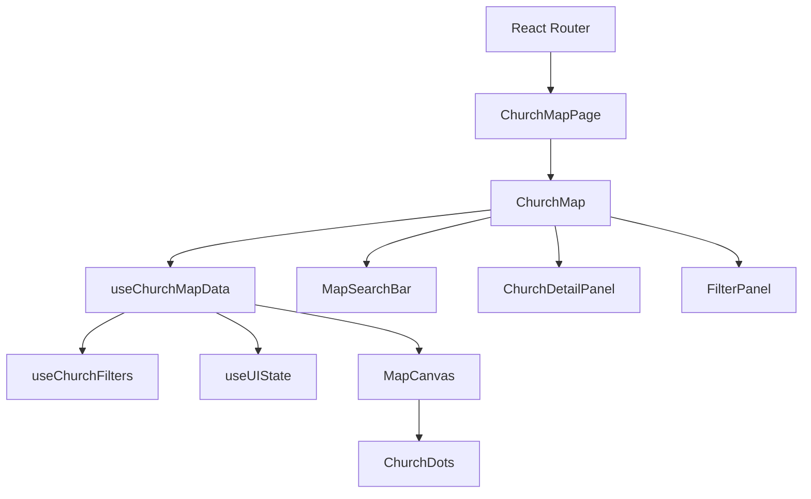

# App architecture and how it works

This doc explains how **Here's My Church** is built: what it does, how the frontend and backend connect, how data flows from URL to map, and where key features live. Use it as a top-to-bottom read or a reference when navigating the codebase.

---

## 1. What the app is

**Here's My Church** is an interactive US map for discovering Christian churches by state. You can filter by size, denomination, and language; search by name; open a church’s detail panel; and use community features (suggest edits, add churches, reactions, alerts).

**Core flows:**

- **National view** → click a state → **state view** with churches on the map → click a church or pick from search → **church detail panel** (info, service times, suggestions, reactions).
- **Add church** (form) and **suggest edit** (per-church suggestions).
- **Churches needing review** (incomplete data) and **moderator** actions (approve/reject suggestions and pending churches).

---

## 2. Tech stack (at a glance)

| Layer | Technology |
|-------|------------|
| **Frontend** | Vite + React 18, React Router 7, Tailwind v4, Radix UI, react-simple-maps + d3-geo |
| **Backend** | Single Supabase Edge Function (Hono) — `make-server-283d8046`. No Next.js or other API routes. |
| **Data** | One Supabase table used by the edge function: `kv_store_283d8046` (key/value JSON). Church and state data is served from this KV layer (populated by the server from OSM, Census, etc.). |
| **Realtime** | Supabase Realtime (presence on `active-users` channel) for “who’s viewing this state.” |
| **Hosting** | Netlify: SPA from `dist/`, with edge functions for geo-inject and OG meta rewrite. |

---

## 3. Architecture diagram

**From URL to pixels (frontend flow):**

---

## 4. Entry point and routing

**Entry chain:**

- [index.html](index.html) → [src/main.tsx](src/main.tsx) → [src/app/App.tsx](src/app/App.tsx) (`RouterProvider`) → [src/app/routes.ts](src/app/routes.ts).

**Routes:** All routes render **ChurchMapPage**; URL params drive behavior.

| Path | Behavior |
|------|----------|
| `/` | National overview (states only, no churches). |
| `/state/:stateAbbrev` | State view; churches for that state are loaded and shown on the map. |
| `/state/:stateAbbrev/:segment1/:segment2?` | Church view. Either `segment1` = 8-digit `shortId`, or `segment1` = `"church"` and `segment2` = legacy church ID. |

**Query params:**

- `?key=SECRET` — moderator mode (review UI, moderator API).
- `?review=true` — open the “churches needing review” modal.

**ChurchMapPage** ([src/app/components/ChurchMapPage.tsx](src/app/components/ChurchMapPage.tsx)) only parses the URL and passes `routeStateAbbrev`, `routeChurchShortId`, `routeLegacyChurchId`, and navigation callbacks (`navigateToState`, `navigateToChurch`, `navigateToNational`, etc.) down to **ChurchMap**. No router hooks inside ChurchMap.

---

## 5. Data flow (frontend)

### useChurchMapData

Central hook used by ChurchMap: [src/app/components/useChurchMapData.ts](src/app/components/useChurchMapData.ts).

- **States:** On load, calls `fetchStates()` and stores `states` and `totalChurches`.
- **Churches:** When the route has a state, calls `fetchChurches(stateAbbrev)`, then filters to the state polygon with d3-geo (`filterToStatePolygon`). Result is stored in the reducer as `churches` and cached per state in a ref.
- **Reducer state:** `states`, `churches`, `filteredChurches`, `focusedState`, `selectedChurch`, `zoom`, `center`, `loading`, `error`, `countyFeatures`, and related flags.
- **Composed hooks:** **useChurchFilters** (size / denomination / language → `filteredChurches` and filter stats), **useUIState** (hover, panels, tooltips), **useLoadingOverlay** (loading sayings).

### API layer

All server calls go through [src/app/components/api.ts](src/app/components/api.ts):

- **Base URL:** `https://{projectId}.supabase.co/functions/v1/make-server-283d8046`
- **Auth:** `Authorization: Bearer {publicAnonKey}` (Supabase anon key). Moderator routes also send `Moderator-Key` header.
- **Helpers:** `fetchWithTimeout`, `fetchWithRetry` for reliability.

**API groups and main functions:**

| Group | Functions | Server routes (conceptually) |
|-------|------------|------------------------------|
| States & churches | `fetchStates`, `fetchChurches`, `populateState`, `fetchDenominations` | `/churches/states`, `/churches/:stateAbbrev`, populate, denominations |
| Search | `searchChurches` | `/churches/search` |
| Suggestions | `fetchSuggestions`, `submitSuggestion`, `fetchPendingSuggestions` | suggestions get/submit, pending |
| Pending churches | `fetchPendingChurches`, `addChurch`, `verifyChurch` | pending churches, add, verify |
| Confirm | `confirmChurchData` | confirm |
| Community | `fetchCommunityStats`, `fetchCorrectionHistory`, `fetchReactions`, `submitReaction`, `fetchReactionsBulk` | community stats/history, reactions |
| Alerts | `fetchActiveAlerts`, `fetchAlertProposals`, `submitCreateAlertProposal`, `voteCreateProposal`, `voteResolveProposal` | alerts active, proposals create/vote/resolve |
| Moderator | `fetchModeratorPending`, `moderateApproveSuggestion`, `moderateRejectSuggestion`, `moderateApproveChurch`, `moderateRejectChurch`, `addToInReview`, `removeFromInReview` | moderator pending, approve/reject, in-review |
| Other | `fetchNationalReviewStats`, `fetchStatePopulations` | review-stats, population |

---

## 6. From URL to map (component chain)

**ChurchMap** ([src/app/components/ChurchMap.tsx](src/app/components/ChurchMap.tsx)) calls `useChurchMapData(...)` and gets `d` (churches, filteredChurches, selectedChurch, zoom, center, loaders, setters, etc.). It then passes data and callbacks into:

| Component | Role |
|-----------|------|
| **MapCanvas** | Renders react-simple-maps (ComposableMap, ZoomableGroup), state/county geography, and **ChurchDots**. Receives `filteredChurches`, `center`, `zoom`, click/hover handlers. |
| **ChurchDots** | Renders church markers as SVG circles; uses `useMapContext()` for projection; viewport culling when zoomed; event delegation for click/hover. |
| **MapSearchBar** | Search input; filters in-memory `churches` by name/city/denom (optional viewport filter). On select, calls `navigateToChurch(stateAbbrev, churchShortId)`. |
| **FilterPanel** | Size, denomination, language filters; works with **useChurchFilters** output (filtered list and stats). |
| **ChurchDetailPanel** | Shown when `selectedChurch` is set (from route + reducer). Shows info, service times, suggestions, nearby churches, reactions; uses api for `fetchSuggestions`, `submitSuggestion`, `fetchReactions`, `submitReaction`, `fetchCorrectionHistory`. |
| **MapOverlays** | Loading overlay, full-screen error, error banner, **StateTooltip**, **ChurchTooltip**, **CountyTooltip**. |
| **useActiveUsers** | Realtime presence on `active-users`; used for “active viewers” in tooltips/on-map labels. |

Selected church is driven by the route (`routeChurchShortId` / `routeLegacyChurchId`) and `selectedChurch` from useChurchMapData; ChurchMap syncs route ↔ reducer and passes `selectedChurchId` into MapCanvas/ChurchDots.

---

## 7. Backend (edge function)

**Single Hono app:** [supabase/functions/make-server-283d8046/index.ts](supabase/functions/make-server-283d8046/index.ts).

**Route groups:**

- **Churches:** states, by-state list, search, populate, denominations, review-stats.
- **Suggestions:** get/submit, pending; pending churches (add, verify); confirm.
- **Community:** stats/history; reactions get/submit/bulk; alerts (active, proposals create/vote/resolve).
- **Moderator:** pending, approve/reject suggestions and churches, in-review (requires `Moderator-Key`).
- **Other:** health, population, og-image (OG images for sharing), admin (refresh-attendance, enrich-regrid, cleanup-dc, cleanup-blocked-denominations, remove-churches-by-name).

**Storage:** [supabase/functions/make-server-283d8046/kv_store.tsx](supabase/functions/make-server-283d8046/kv_store.tsx) wraps the Supabase table `kv_store_283d8046` (set/get/del, prefix scan). Church and state data is stored and read from here; the server populates it from OSM, Regrid, Census, and community submissions.

**Supporting modules:**

- [og-image.tsx](supabase/functions/make-server-283d8046/og-image.tsx) — generates OG images (state or church) for social sharing.
- [regrid.ts](supabase/functions/make-server-283d8046/regrid.ts) — Regrid integration (parcel/building data).
- [state-populations.ts](supabase/functions/make-server-283d8046/state-populations.ts) — state population data used by the server.

---

## 8. Key types and constants

| What | Where |
|------|--------|
| **Church**, **StateInfo**, **HomeCampusSummary** | [src/app/components/church-data.ts](src/app/components/church-data.ts) |
| **Completeness / “needs review”** (`churchNeedsReview`, tier-1 fields: address, serviceTimes, denomination) | [src/app/components/church-data.ts](src/app/components/church-data.ts) |
| **API request/response types** (e.g. `StatesResponse`, `ChurchesResponse`, `SuggestionsResponse`, `ModeratorPendingResponse`) | [src/app/components/api.ts](src/app/components/api.ts) |
| **Map constants** (STATE_BOUNDS, STATE_NAMES, STATE_NEIGHBORS, etc.) | [src/app/components/map-constants.ts](src/app/components/map-constants.ts) |

---

## 9. Features (short index)

| Feature | Components / hooks | Notes |
|---------|--------------------|--------|
| **Map and navigation** | ChurchMap, MapCanvas, ChurchDots, MapSearchBar, FilterPanel, MapLegend, MapControls | URL-driven state/church selection; filters from useChurchFilters. |
| **Church detail** | ChurchDetailPanel | Info, service times, suggestions, nearby churches, reactions. |
| **Add / suggest** | AddChurchForm, SuggestEditForm | Pending churches and verification: VerificationModal, NationalReviewModal. |
| **Moderation** | ReviewPill | Moderator endpoints; `?key=...` for review view; approve/reject suggestions and churches. |
| **Community** | Reactions, alerts (active + proposals), community stats | PendingAlertsPill, AnnouncementsPill; api functions for stats, reactions, alerts. |
| **Realtime** | useActiveUsers | Supabase presence on `active-users`; “active viewers” by state. |

---

## 10. Deployment and scripts

**Netlify:**

- Build: `pnpm run build` (Vite → `dist/`).
- Publish: `dist`.
- Edge functions:
  - **geo-inject** — runs on `/*`; injects detected US state into HTML (uses context.geo).
  - **og-rewrite** — runs on `/state/*`; for crawler user-agents, rewrites HTML meta (og/twitter) and title to use per-page OG images from the Supabase og-image endpoint.

**Supabase:**

- Deploy the edge function: `supabase functions deploy make-server-283d8046` (or `npx supabase functions deploy make-server-283d8046` if `supabase` is not in PATH). See [.cursor/rules/supabase-deploy.mdc](.cursor/rules/supabase-deploy.mdc).

**Scripts:**

- `scripts/generate-sitemap.mjs` — run at prebuild; generates sitemap.
- `scripts/generate-state-populations.mjs` — refresh state/county population totals from Census; then redeploy edge function.
- `scripts/cleanup-blocked-denominations.mjs` — cleanup related to blocked denominations.

---

## Summary

- **One page, one route component:** React Router renders **ChurchMapPage** for all routes; URL params drive state and church.
- **One data hook:** **useChurchMapData** owns states, churches, filters, and map view state; it talks to the **api** module, which talks to the **Supabase edge function**.
- **One backend:** The **make-server-283d8046** Hono app and **kv_store** table; Realtime for presence only.
- **One host:** Netlify serves the SPA and edge functions; Supabase runs the API and Realtime.

Use this doc plus the linked file paths to jump into the code and trace any flow end-to-end.
