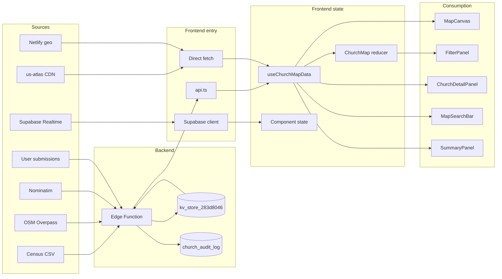

# Data flow: sources to UI

For component hierarchy, routing, and API groups, see [ARCHITECTURE.md](ARCHITECTURE.md). This doc traces **where data comes from**, **how it enters the system**, **where it is stored**, **how it is transformed**, and **where it is used**.

---

## 1. Overview

---

## 2. Data categories

### Church and state lists

| Stage | Detail |
|-------|--------|
| **Source** | OSM (Overpass API for church nodes), Nominatim (geocoding), and community submissions (add church, suggest edit). |
| **Ingestion** | Edge function [supabase/functions/make-server-283d8046/index.ts](supabase/functions/make-server-283d8046/index.ts): `populateState` fetches from Overpass + Nominatim and writes to KV; add/verify/suggest endpoints write to KV. Reads from [kv_store.tsx](supabase/functions/make-server-283d8046/kv_store.tsx). |
| **Storage** | KV keys (e.g. `churches:STATE`, `states`). Edge serves via `/churches/:stateAbbrev`, `/churches/states`. |
| **Transformation** | [api.ts](src/app/components/api.ts) → [useChurchMapData.ts](src/app/components/useChurchMapData.ts): `filterToStatePolygon` (d3-geo) filters raw churches to state polygon; `viewChurches` narrows by county when in county view; [useChurchFilters](src/app/components/hooks/useChurchFilters.ts) → `filteredChurches` (size, denomination, language). |
| **Consumption** | ChurchMap, MapCanvas, ChurchDots, FilterPanel, ChurchListModal, ChurchDetailPanel, MapSearchBar. |

---

### Geography

| Stage | Detail |
|-------|--------|
| **Source** | CDN: [map-constants.ts](src/app/components/map-constants.ts) `GEO_URL` and `COUNTIES_GEO_URL` (us-atlas states-10m and counties-10m TopoJSON). |
| **Ingestion** | `fetch(GEO_URL)` and `fetch(COUNTIES_GEO_URL)` in [useChurchMapData.ts](src/app/components/useChurchMapData.ts) on mount. |
| **Storage** | Refs: `stateFeatures`, county map; reducer: `countyFeatures`. |
| **Transformation** | TopoJSON → feature objects (topojson-client); used for polygon containment in `filterToStatePolygon` and county filtering in `viewChurches`. |
| **Consumption** | MapCanvas (state/county shapes), `filterToStatePolygon`, `viewChurches` (county filter). |

---

### State populations

| Stage | Detail |
|-------|--------|
| **Source** | Census 2023 CSV (population estimates). |
| **Ingestion** | [scripts/generate-state-populations.mjs](scripts/generate-state-populations.mjs) fetches Census CSV and emits [state-populations.ts](supabase/functions/make-server-283d8046/state-populations.ts) (server). Client gets data via API only. |
| **Storage** | Server: in-memory `POP` in state-populations module; client: `fetchStatePopulations()` → reducer `statePopulations` in useChurchMapData. |
| **Transformation** | None beyond API response. |
| **Consumption** | SummaryPanel, map/state stats. |

---

### County populations

| Stage | Detail |
|-------|--------|
| **Source** | Same Census 2023 CSV. |
| **Ingestion** | [scripts/generate-county-populations.mjs](scripts/generate-county-populations.mjs) → [county-populations.ts](src/app/components/data/county-populations.ts). |
| **Storage** | Client-only: imported constant `COUNTY_POPULATIONS`. |
| **Transformation** | None. |
| **Consumption** | Used where county-level population stats are needed. |

---

### User region

| Stage | Detail |
|-------|--------|
| **Source** | Netlify geo (context.geo). |
| **Ingestion** | geo-inject edge writes `<meta name="x-user-region">` into HTML. |
| **Storage** | Read in [useChurchMapData.ts](src/app/components/useChurchMapData.ts): `document.querySelector('meta[name="x-user-region"]')?.content` → `detectedState`. |
| **Transformation** | Map region code to state (e.g. DC → MD). |
| **Consumption** | “Your state” suggestions, UX hints. |

---

### Community (suggestions, pending churches, reactions, stats)

| Stage | Detail |
|-------|--------|
| **Source** | User actions in the UI (suggest edit, add church, verify, reactions). |
| **Ingestion** | [api.ts](src/app/components/api.ts): `submitSuggestion`, `addChurch`, `verifyChurch`, `submitReaction`, etc. → edge → KV and/or audit table. |
| **Storage** | KV and DB; frontend loads via `fetchPendingSuggestions`, `fetchSuggestions`, `fetchCommunityStats`, etc. into component/local state. |
| **Transformation** | None material. |
| **Consumption** | ChurchDetailPanel, SuggestEditForm, VerificationModal, SummaryPanel, moderation UI. |

---

### Alerts

| Stage | Detail |
|-------|--------|
| **Source** | User proposals and votes. |
| **Ingestion** | `submitCreateAlertProposal`, `voteCreateProposal`, `voteResolveProposal` in [api.ts](src/app/components/api.ts) → edge → KV. |
| **Storage** | KV; frontend: `fetchActiveAlerts`, `fetchAlertProposals` → component state. |
| **Transformation** | None. |
| **Consumption** | PendingAlertsPill, alert UI. |

---

### Moderator and audit

| Stage | Detail |
|-------|--------|
| **Source** | Moderator actions and server-side writes. |
| **Ingestion** | Moderator API and [audit.ts](supabase/functions/make-server-283d8046/audit.ts) → KV + `church_audit_log`. |
| **Storage** | KV; `church_audit_log`; frontend: `fetchModeratorPending`, `fetchAuditByState`, etc. → ChurchMap/local state. |
| **Transformation** | None. |
| **Consumption** | ChurchMap (mod panel), AuditModal, review UI. |

---

### Realtime presence

| Stage | Detail |
|-------|--------|
| **Source** | Supabase Realtime. |
| **Ingestion** | [useActiveUsers](src/app/components/hooks/useActiveUsers.ts) subscribes to `active-users` channel via [supabase.ts](src/app/lib/supabase.ts). |
| **Storage** | In-memory in hook / Realtime. |
| **Transformation** | None. |
| **Consumption** | StateTooltip, on-map “active viewers” labels. |

---

### Search (national view)

| Stage | Detail |
|-------|--------|
| **Source** | Same church data as church/state lists (KV). |
| **Ingestion** | `searchChurches(query)` in [api.ts](src/app/components/api.ts) → edge → KV/search path. |
| **Storage** | No persistent frontend cache; [MapSearchBar](src/app/components/MapSearchBar.tsx) holds `remoteResults` in state. |
| **Transformation** | Ranking in API. |
| **Consumption** | MapSearchBar (national view). |

---

## 3. Response `source` values (glossary)

API and audit responses sometimes include a `source` field indicating where a value originated. Common values:

| Value | Meaning |
|-------|--------|
| `kv-cache` | Value read from KV store (e.g. cached church list). |
| `census-2023` | State or county population from Census 2023 data. |
| `fallback` | Fallback value when primary source is missing. |
| `community` | From community submission (suggestion, add church, etc.). |
| `populate` | From server-side populate (Overpass/Nominatim). |
| `moderate_approve` | Applied after moderator approval. |

These are used for transparency and debugging, not as a separate ingest pipeline.
