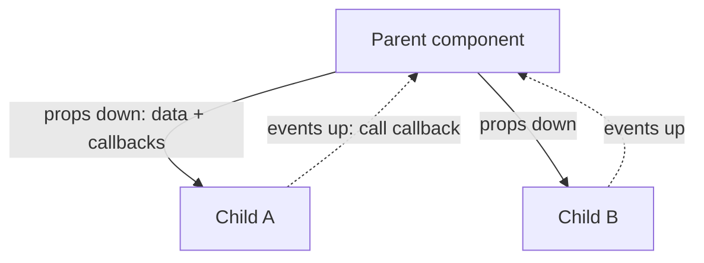
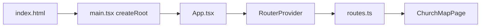
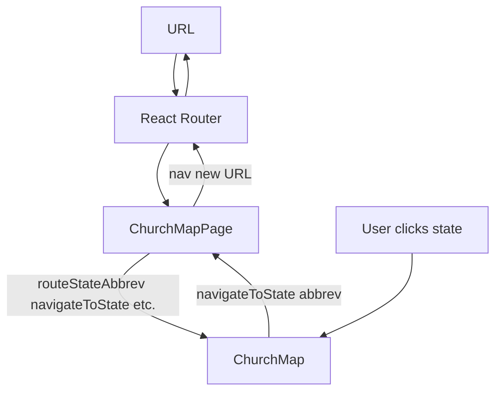
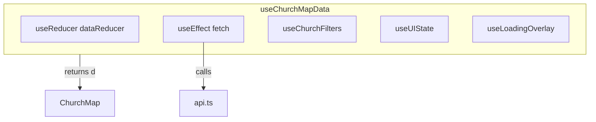
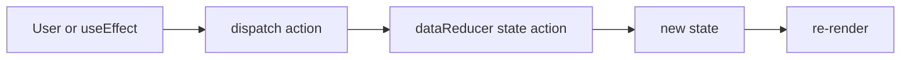
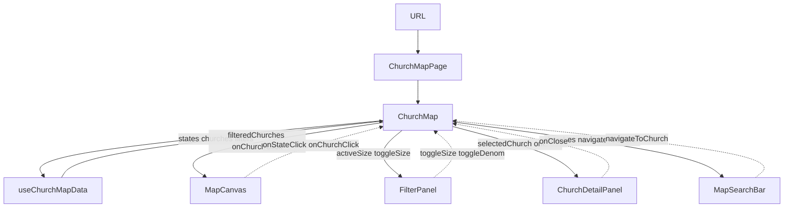
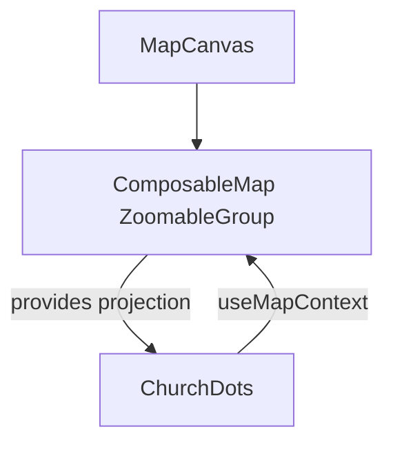
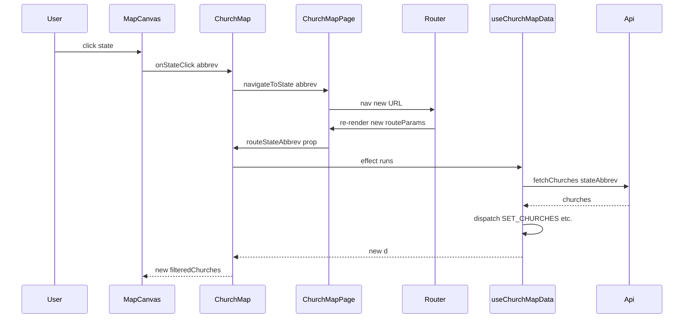
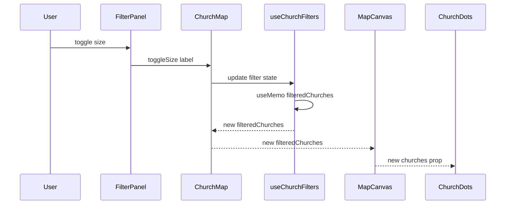

# Learning React in this app

This doc teaches React concepts **in the context of Here's My Church**. If you've never used React (or have only dabbled), read this first; then use [ARCHITECTURE.md](ARCHITECTURE.md) for the full system: backend, API, deployment.

You'll learn: what components and props are, where state lives, how data gets from the URL to the map, and how to trace a click or a filter change through the code.

---

## 1. React in 5 minutes

### Components

A **component** is a function that returns a description of the UI. That description is written in **JSX**: HTML-like syntax that becomes React elements. Examples in this app: `ChurchMap`, `FilterPanel`, `Button`. Each can be used like a tag: `<ChurchMap ... />`, `<FilterPanel ... />`.

### Props

**Props** are data (and callbacks) passed **from parent to child**. They are read-only. The parent decides what the child receives. Examples: `ChurchMapPage` passes `navigateToState` and `routeStateAbbrev` into `ChurchMap`; `ChurchMap` passes `activeSize`, `toggleSize`, and more into `FilterPanel`.

### State

**State** is data that can change over time and that lives inside a component (or inside a hook the component uses). When state updates, React re-renders that part of the tree. This app uses both `useState` (for a single value or small state) and `useReducer` (for a larger, structured state object).

### One-way data flow

Data flows **down** (via props). Events flow **up** (the child calls a function that was passed as a prop). There is no two-way binding: the parent owns the state and passes down both the value and a way to update it (e.g. a callback).



In the sections below you'll see this pattern everywhere: **ChurchMapPage** → **ChurchMap** → **MapCanvas**, **FilterPanel**, etc.

---

## 2. How this app starts (entry point)

When the app loads, this is what runs:

1. **index.html** — Contains a single `<div id="root">` and a script that loads [src/main.tsx](src/main.tsx).
2. **src/main.tsx** — Calls `createRoot(document.getElementById("root")!)` and renders `<App />` into that div. That’s the only place the DOM is touched for the initial React tree.
3. **src/app/App.tsx** — Renders the app wrapped in `AppErrorBoundary` and `RouterProvider`. The router is created in [src/app/routes.ts](src/app/routes.ts).
4. **src/app/routes.ts** — Defines the routes. Every route in this app renders the **same** component: **ChurchMapPage**. The URL path and query params determine behavior (national vs state vs church, moderator key, review modal).



**Takeaway:** One React tree, one route component. The URL is the source of truth for "where we are."

---

## 3. URL → page: routing and the single page

React Router matches the path and always renders **ChurchMapPage** for:

- `/` — national overview
- `/state/:stateAbbrev` — state view
- `/state/:stateAbbrev/:segment1/:segment2?` — church view (segment1 is either an 8-digit church shortId or `"church"` with segment2 as legacy id)

**ChurchMapPage** ([src/app/components/ChurchMapPage.tsx](src/app/components/ChurchMapPage.tsx)) does the following:

- Uses router hooks: `useLocation()` and `useNavigate()`.
- Parses the path and search string into `routeParams` (stateAbbrev, churchShortId, legacyChurchId, openReviewModalFromQuery, moderatorKey) with `useMemo`.
- Defines navigation callbacks with `useCallback`, e.g. `navigateToState(abbrev)` → `nav(\`/state/${abbrev}...\`)`.
- Renders **one child:** `<ChurchMap ... />`, passing route params and those callbacks as **props.**

**ChurchMap** never imports the router. It receives everything it needs via props ("props down"). When the user clicks a state, ChurchMap calls `navigateToState(abbrev)`; the URL changes, React Router re-renders ChurchMapPage with new params, and those flow back into ChurchMap as new props.



**Takeaway:** Routing is isolated in ChurchMapPage. ChurchMap is a "pure" map component that gets route state and navigation via props.

---

## 4. Where the data lives: useChurchMapData

**ChurchMap** gets all map and church data (and setters) from one custom hook:

```ts
const d = useChurchMapData({ routeStateAbbrev, routeChurchShortId, routeLegacyChurchId, navigateToState, navigateToChurch, navigateToNational, isMobile });
```

See [src/app/components/useChurchMapData.ts](src/app/components/useChurchMapData.ts).

### What is a custom hook?

A **custom hook** is a function whose name starts with `use` and that can call other hooks (useState, useReducer, useEffect, etc.). It encapsulates state and side effects and returns values and setters for the component to use. The component doesn’t care how the data is fetched or stored—it just uses `d`.

### What useChurchMapData does

- **Reducer** — Uses `useReducer(dataReducer, initialDataState)` for core state: `states`, `churches`, `filteredChurches`, `focusedState`, `selectedChurch`, `zoom`, `center`, `loading`, `error`, and more. The reducer is a single function that takes the current state and an "action" (e.g. `{ type: "SET_CHURCHES", value: [...] }`) and returns the new state. One state object, one dispatch function; actions describe what changed.
- **Effects** — Uses `useEffect` to fetch states on load and to fetch churches when `routeStateAbbrev` changes. Fetched data is stored via the reducer (dispatch).
- **Composed hooks** — Calls **useChurchFilters** (size, denomination, language → `filteredChurches` and filter stats), **useUIState** (hover, panels, tooltips), and **useLoadingOverlay** (loading sayings). So "where the data lives" is mostly inside useChurchMapData and its sub-hooks.
- **API** — All server calls go through [src/app/components/api.ts](src/app/components/api.ts) (e.g. `fetchStates()`, `fetchChurches(stateAbbrev)`). The hook calls these inside `useEffect` and puts results into the reducer. This app does not use a data library like React Query—just fetch and reducer.



Optional mental model for the reducer:



**Takeaway:** One hook owns map data and view state. It talks to the API and exposes `d` to ChurchMap, which passes slices of `d` down to MapCanvas, FilterPanel, ChurchDetailPanel, etc.

---

## 5. How the UI gets that data (props down, events up)

**ChurchMap** passes props to:

| Component | What it gets | What happens when user acts |
|-----------|--------------|-----------------------------|
| **MapCanvas** | `filteredChurches`, `center`, `zoom`, `onStateClick`, `onChurchClick`, `onChurchHover`, … | MapCanvas passes churches and callbacks to **ChurchDots**. Clicks call `onStateClick(abbrev)` or `onChurchClick(church)`. |
| **FilterPanel** | `activeSize`, `toggleSize`, `activeDenominations`, `toggleDenom`, … (from useChurchFilters via `d`) | User toggles a filter → FilterPanel calls `toggleSize(label)` → state inside useChurchMapData updates → `filteredChurches` changes → ChurchMap re-renders → MapCanvas and ChurchDots get new `filteredChurches`. |
| **ChurchDetailPanel** | `selectedChurch`, `onClose`, callbacks for suggestions/reactions | Panel uses the API for its own fetches (suggestions, reactions). |
| **MapSearchBar** | List of churches, `navigateToChurch(stateAbbrev, churchShortId)` | User selects a result → `navigateToChurch` is called → URL changes → selected church updates from route. |

**Events up:** Clicks and toggles do not update local state in the child. They call parent-provided callbacks. The parent (or its hook) holds the state, updates it, then passes new props down.



Solid arrows = props down. Dashed = events up (callbacks).

---

## 6. Hooks you'll see in this codebase

| Hook | Purpose | In this app |
|------|---------|-------------|
| **useState** | Hold a single value (or small state) that can change; re-render when it does. | ChurchMap’s `stateViewSearchResultIds`, modal open/close flags. |
| **useReducer** | Hold a larger state object; update it by dispatching actions. | useChurchMapData’s `dataReducer`; ChurchMap’s `localReducer`. |
| **useEffect** | Run code after render (e.g. fetch, subscribe). Runs when dependencies in the dependency array change. | useChurchMapData: fetch states on load, fetch churches when `routeStateAbbrev` changes. |
| **useMemo** | Remember a computed value until dependencies change; avoid recalculating every render. | `filteredChurches` in useChurchFilters; `routeParams` in ChurchMapPage. |
| **useCallback** | Remember a function so it’s stable across renders (same function reference when deps don’t change). | Navigation callbacks in ChurchMapPage; handlers in ChurchMap. |
| **useChurchMapData** | Custom hook: states, churches, filters, map view state, loading, errors. | Used by ChurchMap. |
| **useChurchFilters** | Custom hook: filter churches by size, denomination, language; return filtered list and stats. | Used inside useChurchMapData. |
| **useUIState** | Custom hook: hover state, panel visibility, tooltips. | Used inside useChurchMapData. |
| **useLoadingOverlay** | Custom hook: loading sayings for overlay. | Used inside useChurchMapData. |
| **useActiveUsers** | Custom hook: Supabase Realtime presence for "who’s viewing this state." | Used in ChurchMap for tooltips/labels. |

---

## 7. Context (when it's used here)

**What is context?** React Context lets a parent provide a value to the whole subtree. Any descendant can call `useContext(SomeContext)` to read that value without props being passed through every level. The parent is the "Provider"; the consumer is any component that uses `useContext`.

**In this app:** The app does not put app-wide state in React Context. The main context usage is from libraries:

- **react-simple-maps** — MapCanvas wraps the map in `ComposableMap` and `ZoomableGroup`, which provide a map context. **ChurchDots** calls `useMapContext()` to get the **projection** (a function that turns longitude/latitude into SVG x,y). That’s how dots are positioned on the map.
- **Radix UI** — Components like Form, Tooltip, Carousel use internal React Context for compound components. You don’t need to implement context yourself to follow the architecture.



---

## 8. Performance: React.memo and event delegation

**React.memo** — Wrapping a component in `memo()` means React will only re-render it when its **props** change. In this app, **MapCanvas** and **ChurchDots** are wrapped in `memo`. That way, when only hover or tooltip state changes, ChurchDots doesn’t re-render thousands of dots. See the comment at the top of [src/app/components/ChurchDots.tsx](src/app/components/ChurchDots.tsx).

**Event delegation** — Instead of attaching a click/hover listener to every church dot, ChurchDots attaches one handler to the parent `<g>` and checks which dot was hit (e.g. via `data-id` or `event.target`). That reduces the number of listeners and allocations when there are many churches.

---

## 9. Types and constants (where to look)

| What | Where |
|------|--------|
| **Church**, **StateInfo**, **HomeCampusSummary** | [src/app/components/church-data.ts](src/app/components/church-data.ts) |
| API request/response types (e.g. StatesResponse, ChurchesResponse) | [src/app/components/api.ts](src/app/components/api.ts) |
| Map constants (STATE_BOUNDS, STATE_NAMES, etc.) | [src/app/components/map-constants.ts](src/app/components/map-constants.ts) |

Components often define an **interface** for their props (e.g. `ChurchMapProps`, `FilterPanelProps`). That’s the "contract" for what the parent must pass.

---

## 10. Trace two flows yourself

### "I clicked a state"

1. User clicks a state on the map.
2. MapCanvas’s `onStateClick(abbrev)` runs (passed from ChurchMap).
3. ChurchMap got that callback from ChurchMapPage: it’s `navigateToState`.
4. `navigateToState(abbrev)` calls `nav(\`/state/${abbrev}...\`)` → URL changes.
5. React Router re-renders ChurchMapPage with new `location.pathname`.
6. ChurchMapPage’s `useMemo` recalculates `routeParams`; `stateAbbrev` is now set.
7. ChurchMap receives new `routeStateAbbrev` as a prop.
8. useChurchMapData’s `useEffect` (with `routeStateAbbrev` in the dependency array) runs.
9. It calls `fetchChurches(stateAbbrev)` from api.ts, then dispatches to the reducer to set `churches` and `focusedState`.
10. ChurchMap re-renders with new `d`; MapCanvas gets new `filteredChurches` and geography; the map shows the state and its churches.



### "I toggled a filter"

1. User toggles a size filter in FilterPanel.
2. FilterPanel calls `toggleSize(label)` (passed from ChurchMap; it comes from useChurchFilters via `d`).
3. Filter state (e.g. `activeSize`) updates inside useChurchMapData.
4. useChurchFilters recalculates `filteredChurches` (its `useMemo` depends on `activeSize`, etc.).
5. `d.filteredChurches` changes → ChurchMap re-renders.
6. MapCanvas and ChurchDots receive new `churches` (filtered list) → only dots that match the filter stay visible.



---

## 11. Glossary and learn more

| Term | Meaning |
|------|---------|
| **Component** | A function that returns JSX (or another component). |
| **JSX** | Syntax that looks like HTML; describes React elements. |
| **Props** | Data and callbacks passed from parent to child; read-only. |
| **State** | Data that can change; lives in a component or hook; updates cause re-renders. |
| **Hook** | A function (useX) that lets you use state, effects, or context inside a component. |
| **Custom hook** | A function starting with `use` that composes other hooks and returns values/setters. |
| **Reducer** | A function (state, action) → new state; used with useReducer. |
| **Effect** | Side effect (fetch, subscribe) run after render via useEffect. |
| **Dependency array** | The second argument to useEffect/useMemo/useCallback; when it changes, the effect/memo/callback runs or updates. |
| **Context** | A way to pass a value down the tree without prop drilling; Provider + useContext. |
| **memo** | HOC so a component re-renders only when its props change. |
| **key** | Prop used in lists so React can match list items across re-renders (e.g. `key={church.id}`). |

**Learn more:**

- [React: Thinking in React](https://react.dev/learn/thinking-in-react) — breaks down UI into components and state.
- [React: Hooks](https://react.dev/reference/react) — useState, useEffect, useReducer, etc.
- [ARCHITECTURE.md](ARCHITECTURE.md) — full system: backend, API routes, deployment, Twitter automation.

This doc plus ARCHITECTURE should be enough to read the codebase and trace any flow from URL to map.
