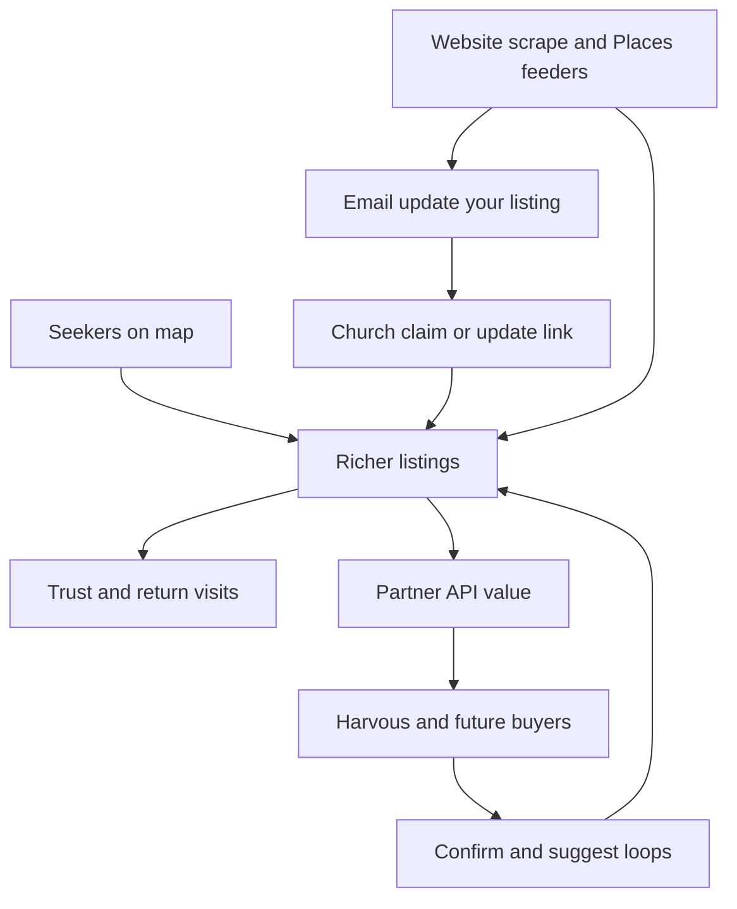

# Future: Claimable Listings, Traction, and the Paid API

Product strategy for how Here’s My Church can become more useful and get more traction — without confusing the map directory for a church website CMS, and without abandoning the paid partner API as the primary monetization path.

**This doc is not a sprint ticket list.** It captures the thesis, sequencing, and hard “not yet” decisions so later slices stay coherent.

Related:

- [faster-church-data-review.md](./faster-church-data-review.md) — how to clear the needs-review backlog (automation + thin self-update)
- [google-places-bulk-enrichment.md](./google-places-bulk-enrichment.md) — Places as address/website feeder only
- [public-api.md](./public-api.md) — partner `/v1` contract
- [polar-api-billing.md](./polar-api-billing.md) — paid multi-tenant API via Polar
- [review-imports.md](./review-imports.md) — star/written reviews (orthogonal, later)
- [sponsored-area.md](./sponsored-area.md) — alternate map monetization
- [DATA-FLOW.md](../DATA-FLOW.md), [ARCHITECTURE.md](../ARCHITECTURE.md)

---

## Thesis in one line

**HMC wins when every church has one canonical, claimable listing that seekers trust and products can query — the “website for churches without one” is a bonus skin on that listing, not the first product.**

Two bets reinforce each other:

| Bet | Role |
|-----|------|
| **Richer, reviewed listings + claim** | Seeker usefulness, church engagement, data truth |
| **Paid partner API** | Clean B2B monetization once IDs and fields are trustworthy |

They are not competing roadmaps. Claim and review velocity make the API worth paying for; the API (and partners like Harvous) feed confirm/suggest loops back into the directory.

---

## Why “Yelp of churches” is useful — and where it breaks

### What travels well from the Yelp analogy

- **Canonical listing per place** — one durable record seekers and apps can rely on.
- **Claim** — the institution that knows the truth can assert ownership and update the listing.
- **Discovery + detail** — map/search finds you; the profile answers “when, where, what kind, how do I show up?”
- **Network effects** — better data → more seekers → more reason for churches to claim → better data.

### What does *not* travel well

| Yelp pattern | Why HMC should not copy it early |
|--------------|----------------------------------|
| Star ratings / review culture as growth engine | Churches are not restaurants; reputation warfare is a poor fit. We already have soft **reactions** (`not_for_me` / `like` / `love`). Star imports stay [orthogonal and later](./review-imports.md). |
| Full business suite / ads / CMS on day one | We do not have claim demand yet. A portal without truth in the listing is empty theater. |
| “Claim your business” cold spam | Without scrape-sourced emails + a working update deep link, outreach is noise. Prefer [Stage C in the review doc](./faster-church-data-review.md). |
| Treating Google hours as “open times” | **Hard reject** for worship `serviceTimes`. See review doc constraints. |

So: borrow **claimable directory**, not **ratings marketplace** or **website builder**.

---

## Current product reality

### What a church profile is today

Not a standalone church website — a **map listing + slide-over detail panel** with a shareable deep link.

| Surface | Notes |
|---------|--------|
| Detail UI | [`ChurchDetailPanel.tsx`](../../src/app/components/ChurchDetailPanel.tsx) — size/denom, website, reactions, service times, languages, ministries, pastor/phone/email, campus, nearby, confirm, suggest-edit, correction history |
| Model | [`church-data.ts`](../../src/app/components/church-data.ts) — geo, address, denomination, attendance, serviceTimes, languages, ministries, contact, campus links, `lastVerified`, `listingStatus`, etc. |
| Routes | `/:CC/:region/:shortId` (plus legacy state paths); OG images for crawlers |
| “Verified” map filter | **Data completeness** (address + service times + website) — **not** ownership |

### What does *not* exist today

- Church claim / ownership accounts
- DNS or `hmc-verify.txt` verification
- Church-owned CMS or branded public “site”
- Star or written first-party reviews
- Multi-tenant paid API checkout (Polar) — only a shared partner key for Harvous on `/v1`

### Data quality baseline

- Seeded primarily from **OSM**; community suggest/confirm; ARDA/heuristics for attendance; Places enrichment coded but not assumed in production until batched with a key.
- **Needs review** ≈ missing **2+** of meaningful address / non-placeholder `serviceTimes` / usable denomination (~**74%** at launch).
- Sensitive fields (name, website, address, lifecycle reports, campus) need **moderator** approval; other fields can consensus-apply at `THR = 1`.

API buyers and seekers both choke on incomplete pins. Traction work that ignores review velocity is premature.

---

## How the bets fit together

- **API buyers** pay for stable IDs + searchable, *reviewed* church records — not for a pretty CMS.
- **Claim** (even thin) is the highest-leverage path to real worship times — the field automation must never invent from business hours.
- **Profile-as-website** is a later upside for churches with no site — only after the listing is trustworthy and claimed.

---

## Phased sequencing

Aligns with [faster-church-data-review.md](./faster-church-data-review.md). Do **not** let “Yelp” language jump the queue ahead of data truth.

### Phase 1 — Make data worth claiming and selling

**Goal:** Drive down needs-review; unlock emails and real `serviceTimes`.

| Work | Why |
|------|-----|
| Website scrape on pins that **already** have a website | Provisional times, denom cues, contact email |
| Name → denomination rules for Unknown/Other | Cheap completeness win |
| One-field microtasks (`?review=true`) | Human volume without a full form |
| Places fill-empty address/website only | Feeder into scrape + outreach; never hours → `serviceTimes` |
| Email “update your listing” + **tokenized deep link** | Thin church-sourced truth (see Phase 2) |

Default first implementation slice when ready: **scrape existing sites + name→denom + microtasks → then Places → then outreach**.

Hard constraints (already decided in the review doc):

1. Never map hours of operation → `serviceTimes`.
2. Places only fill-empty address/website (phone optional); never overwrite community corrections.
3. Prefer tokenized update before a full ownership portal.
4. Stay within Maps ~$200/mo credit when running Places batches.

### Phase 2 — Thin claim (traction wedge)

**Goal:** Smallest ownership signal churches understand — Yelp’s early “claim the listing,” not the late business suite.

Ship:

- Entry points: outreach email deep link, and eventually “Update / claim this listing” on the detail panel
- Badge: **Claimed** and/or **Updated by the church** (distinct from completeness “Verified”)
- Elevated trust for token holders on times / contact / non-sensitive fields
- Still **mod-gate** name changes, deletes, and lifecycle reports (`reportClosed`, duplicate, out-of-scope, relocate)

Defer thicker verification until thin claim is proven:

- Magic link to a known church email
- DNS / `hmc-verify.txt` on their domain
- Multi-campus claim via `homeCampusId`

Messaging for outreach: short, clear — who we are, what’s missing, one-click update. **Not** a spam blast of “claim your business.”

### Phase 3 — Sell the API once quality moves

**Goal:** Turn `/v1` into a paid product when a meaningful share of pins are review-cleared and Harvous has validated the contract.

- Separate Polar org for Here’s My Church; per-customer API keys; suggested ~$19/mo + overage ([polar-api-billing.md](./polar-api-billing.md))
- Map stays **free**; **no** public free API scrape tier
- Keep partner resolve responses **lean** by default; richer fields only when completeness and product demand justify it
- Partners should keep using suggest/confirm to improve the corpus ([public-api.md](./public-api.md))

Selling incomplete **lean** refs to a trusted partner (Harvous) is fine. Selling incomplete **rich** dumps to strangers is not.

### Phase 4 — Profile-as-website (only if claim demand proves out)

**Goal:** For churches with no website, the claimed HMC public page can stand alone as a simple presence — still not a full church CMS unless churches ask for it.

Possible shape:

- Standalone public page (edge-to-edge brand + times + contact + ministries) reusing listing richness, not inventing a page builder
- Claim (or equivalent verification) required before customization (logo, short about, preferred contact)
- Shareable URL already exists; this phase is about **presentation and ownership**, not inventing a second data model

Explicitly **out of scope** until demand is real: events calendars, sermon hosting, donation widgets, multi-page site builders, custom domains as a product SKU.

---

## Thin claim — product sketch

### Concepts to keep distinct

| Term | Meaning |
|------|---------|
| **Needs review** | Completeness gap (tier-1 fields) |
| **Verified** (map filter) | Completeness: address + times + website |
| **Confirmed** | Soft community “looks correct” / `lastVerified` bump |
| **Claimed** | Church (or token holder) asserted ownership / update rights |
| **Updated by the church** | Provenance that last meaningful edit came via claim/token path |

Do not overload “verified” to mean ownership. Seekers and mods will confuse the words if we do.

### Tokenized update (Phase 2 core)

Already outlined as Stage C in the review doc:

1. Obtain contact email (scrape `mailto:`, contact page, or later Places — never invent).
2. Send one email (or long cooldown) with a signed token URL for **that** church id.
3. Token opens a constrained update UI for missing tier-1 fields (and maybe phone/email/pastor).
4. Track sent → opened → listing updated; support unsubscribe / “not my church.”
5. Prefer elevated trust for token holders; still mod-gate sensitive lifecycle actions.

### Thicker claim (later)

| Method | Pros | Cons |
|--------|------|------|
| Magic link to scraped/official email | Low friction | Email may be wrong or generic |
| Upload / DNS `hmc-verify.txt` | Strong proof of domain control | Useless if they have no site (ironically our Phase 4 audience) |
| Denominational HQ attestation | Scales for networks | Partnership-heavy |
| Moderator-assisted claim | Handles edge cases | Does not scale |

Multi-campus: claim should attach to a pin; campus links via existing `homeCampusId` / home campus model — do not invent a second org graph until needed.

---

## Profile-as-website — design guardrails (Phase 4)

If/when we ship this:

- **One composition**, brand-first: church name is the hero signal; times + one CTA (“Plan a visit” / directions / call).
- Reuse listing fields; do not fork a separate “site content” store until necessary.
- No card-heavy dashboards on the public page; the map detail panel richness should translate, not densify.
- Claim gate before any custom branding.
- Churches that **already have** a good website should get a great listing + outbound link — not pressure to migrate their site to HMC.

Success metric for this phase is **churches without a site using the page**, not “every church rebuilds on HMC.”

---

## Monetization posture

| Surface | Monetize? | Notes |
|---------|-----------|--------|
| Map / seeker product | No (keep free) | Crowdsourcing and trust |
| Partner `/v1` API | Yes (Polar) | Primary B2B path |
| Sponsored areas | Maybe later | Separate doc; tasteful, approved network |
| Claim itself | No at first | Claim is a data-quality and traction loop; charging to claim too early kills the flywheel |
| Profile-as-website extras | Maybe much later | Only after free claimed presence proves value |

Do not make “pay to claim” the first church-facing SKU.

---

## What not to build yet

- Full church CMS / site builder before tokenized email update works
- “Claim your business” campaigns without emails + a working deep link
- Star-review culture as the primary growth engine
- Expanding public API rich-field surface before completeness improves
- Conflating completeness “Verified” with ownership “Claimed”
- Mapping Google/business hours into `serviceTimes`
- Raising suggestion `THR` above 1 just to feel safer (slows the community path we rely on)

---

## Metrics that would mean the thesis is working

| Metric | Why it matters |
|--------|----------------|
| % churches no longer `churchNeedsReview` | API + seeker quality |
| % with non-placeholder `serviceTimes` | Core seeker job-to-be-done |
| % with usable website or claimed public page | Presence coverage |
| Outreach → update conversion | Thin claim works |
| Claimed / church-updated pin count | Ownership flywheel started |
| Partner `/v1` usage + paid conversions (Phase 3) | Monetization |
| Confirm/suggest volume from partners | API as data flywheel |

Vanity to ignore early: raw pageviews without completeness movement; claim badge count with no field improvements.

---

## Suggested ownership of docs

| Question | Doc |
|----------|-----|
| How do we clear needs-review day to day? | [faster-church-data-review.md](./faster-church-data-review.md) |
| How do we fill address/website at scale? | [google-places-bulk-enrichment.md](./google-places-bulk-enrichment.md) |
| What is the partner API contract? | [public-api.md](./public-api.md) |
| How do we bill the API? | [polar-api-billing.md](./polar-api-billing.md) |
| Why claim + API + profile-as-site, and in what order? | **This doc** |
| Star ratings from Google/Facebook? | [review-imports.md](./review-imports.md) |

When implementing, prefer slices from the review doc’s P0/P1 table. Use this doc to reject scope that jumps to CMS, ratings, or paid claim too early.
