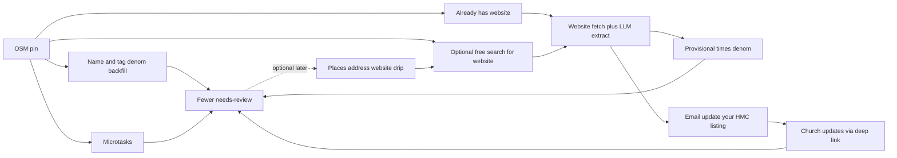

# Future: Faster Church Data Review

Strategy for clearing the “needs review” backlog faster — automation where it is trustworthy, church self-update for worship times, and lower-friction community loops. Capture decisions and ideas so we can implement in slices later. **This doc is not a sprint ticket list.**

**Cost posture:** Prefer **$0 or near-$0** paths first (OSM we already have, name rules, website crawl + cheap LLM extract, community/microtasks, denom CSVs, church email). Google Places’ ~$200/mo Maps credit is **optional and likely not worth burning** until cheaper website discovery is exhausted — see [Is Google Places worth it?](#is-google-places-worth-it-low-cost-view).

Related: [claimable-listings-and-traction.md](./claimable-listings-and-traction.md) (claim + API product thesis), [google-places-bulk-enrichment.md](./google-places-bulk-enrichment.md) (Places fill-empty for address/website — deferred under low-cost priority), [review-imports.md](./review-imports.md) (star ratings — orthogonal), [DATA-FLOW.md](../DATA-FLOW.md), [ARCHITECTURE.md](../ARCHITECTURE.md).

---

## Goal

- Reduce the share of churches that `churchNeedsReview` flags (missing **2+** of address / `serviceTimes` / denomination).
- Grow **real** worship-time coverage — not business/office hours dressed up as service times.
- Prefer **automation + church self-update** over moderator hand-entry of Sunday schedules.
- Aim for on the order of a **~50% improvement in needs-review** (e.g. ~74% → ~37%) over time via stacked low-cost methods — not via one paid API.
- Treat Google Places as an **optional later feeder** for missing address/website, not a required stage of the spine.

---

## What “needs review” means today

### Completeness (public data quality)

Tier-1 fields live in [`src/app/components/church-data.ts`](../../src/app/components/church-data.ts):

| Field | “Missing” when |
|-------|----------------|
| **address** | Empty, too short, or only locality (city / “city, ST”) |
| **serviceTimes** | Empty or placeholder (`unknown`, `see website`, `tbd`, etc.) |
| **denomination** | Empty, `Unknown`, or `Other` |

A church **needs review** when **2 or more** of those are missing (`getTier1Completeness` / `churchNeedsReview`). Filling one field can drop a pin out of the queue without perfect data.

**Verified** (map filter) is a stricter, separate concept: meaningful address + non-placeholder service times + usable website. Do not conflate with needs-review.

Public UX: `?review=true`, [`VerificationModal.tsx`](../../src/app/components/VerificationModal.tsx), SummaryPanel “Churches Needing Review”, national/state stats via `GET …/churches/review-stats`. Baseline at launch was roughly ~74% needing review (`monthly_impact_snapshots` migration).

### What “improve ~50%” means

Interpret the target as **cutting needs-review rate roughly in half** (or clearing ~half of currently incomplete pins), not “every field perfect on 50% of churches.”

Because the rule is **2+ missing**, you win by:

1. Filling **denomination** on Unknown/Other (often free from the name).
2. Filling **address** or **website** when cheap (OSM leftovers, search, later Places).
3. Filling **serviceTimes** only from worship-time sources (site scrape + LLM, church email, humans).

Pins missing all three need **two** successful fills to leave the queue. Pins missing exactly two need **one**. Prioritize cohorts that are one fill away.

### Community suggest / confirm

| Path | Behavior |
|------|----------|
| Suggest edit | [`SuggestEditForm.tsx`](../../src/app/components/SuggestEditForm.tsx) → `POST …/suggestions` |
| Consensus | `THR = 1` (one unique IP can approve a field value) |
| Non-sensitive | Auto-applied (`attendance`, `denomination`, `serviceTimes`, `languages`, `ministries`, `pastorName`, `phone`, `email`) |
| Sensitive | Stored with `needsModeration`; **not** written until a moderator approves: `name`, `website`, `address`, reports (`reportClosed`, `reportDuplicate`, `reportOutOfScope`, `reportRelocated`), `homeCampusId` |
| Confirm | `POST …/churches/confirm/:id` bumps `lastVerified` (IP, 1/day) |

### Moderator queue

Entered with `?key=<MODERATOR_KEY>`. [`ReviewPill.tsx`](../../src/app/components/ReviewPill.tsx) polls `GET …/moderate/pending`: pending sensitive suggestions, pending churches, `listingStatus: "pending_reverify"` (post-relocate), and claimed “in review” items. Approve/reject (+ edit-on-approve) audited to `church_audit_log`.

### Data sources today

| Source | Role |
|--------|------|
| OSM via Overpass | Primary bulk pins; parse already maps `denomination`/`name` via `RULES`/`normD`, `addr:*`, `website`/`contact:website`, `service_times` / `service_times:sunday`, and currently may fall back to `opening_hours` (see cleanup note below) |
| ARDA + heuristics | Attendance estimates |
| Community add / suggest | Live corrections; adds often auto-live |
| Nominatim | Geocode on address / relocate apply (public instance: ~1 req/s, no bulk abuse) |
| Google Places enrichment | Code exists ([`google-places-enrichment.ts`](../../supabase/functions/make-server-283d8046/google-places-enrichment.ts), `POST …/admin/enrich-google/:state`); fill-empty address/city/phone/website; **never writes serviceTimes from hours**. **Deferred** under low-cost priority |

**OSM `opening_hours` cleanup (important):** In `parse()` today, `rawServiceTimes` can come from `t.opening_hours` when dedicated `service_times` tags are absent. That can store **office hours** as `serviceTimes`, which violates the product constraint. A low-cost win: stop using `opening_hours` for `serviceTimes` on new populates, and optionally clear/reclassify existing values that look like weekday office hours (Mon–Fri ranges with no Sunday worship language).

---

## Hard constraints (decisions already made)

1. **Never map hours of operation → `serviceTimes`.** Building/office “open Mon–Fri 9–5” is not when people gather for worship.
2. **Low cost first.** Exhaust $0 / near-$0 enrichment and church-sourced update before spending Maps credit.
3. If Places is ever used: **only fill-empty `address` and/or `website`** (phone optional); never overwrite community corrections; never use hours as worship times.
4. Places is a **feeder**, not a completeness silver bullet — filling address alone often leaves the pin still needing review.
5. Do **not** raise `THR` above 1 just to “be safer.”
6. Prefer a **tokenized “update your listing” link** before a full church CMS.
7. AI may **extract from evidence** (page text you fetched). AI must **not invent** service times from name + city with no source page.

---

## Is Google Places worth it? (low-cost view)

**Default recommendation under low-cost priority: skip or defer Places.** Keep the enrichment code; do not make it a P0/P1 dependency.

### Why $200/mo credit is a weak fit for our goal

| Reality | Implication |
|---------|-------------|
| Credit buys **address / phone / website**, not worship times | Does not solve the hardest tier-1 field |
| Full national match is **far more** than $200 (search + details × hundreds of thousands of pins) | At best a slow drip of websites/addresses per month |
| Many pins that get an address still miss times + denom → **still needs review** | Credit spent without moving the headline metric |
| We already have websites on a subset of OSM pins | Scrape that subset for **$0 API spend** first |
| Website discovery has cheaper alternatives | DuckDuckGo/Bing HTML search, site: queries, denom directories, Wikidata (sparse), community |
| Engineering + matching QA cost is real | Wrong Place matches create bad addresses/websites worse than empty |

### When Places *would* become worth a pilot

Revisit only if **all** of these are true:

1. You’ve scraped every church that already has a website and measured hit rates.
2. You’ve run denom backfill + microtasks and still need more **websites** specifically for outreach.
3. A dry-run shows Places would add websites for a large share of “has email potential / large attendance / high traffic states” at a predictable monthly pin count under $200.
4. You’re okay treating Places as a **monthly drip**, not a one-shot national fix.

Until then: document stays optional; see [google-places-bulk-enrichment.md](./google-places-bulk-enrichment.md) for the technical design if/when needed.

### Cost comparison (rough)

| Approach | Cash cost | What it buys | Moves needs-review? |
|----------|-----------|--------------|---------------------|
| Re-apply / tighten `normD` name rules on existing KV | $0 | denomination | Yes, for one-fill-away pins |
| Stop `opening_hours` → `serviceTimes` | $0 | Data honesty (may *increase* needs-review temporarily) | Quality, not vanity metrics |
| Crawl existing websites + regex/LLM extract | $0–few $/mo LLM | times, denom, email | Yes where site has worship info |
| Search-for-website (DDG/Bing, careful rate limits) | $0 | more websites → more scrape | Indirect |
| Church email (Resend/Postmark free tiers) | $0–low | real times from pastors | Yes if conversion is OK |
| Microtasks / sprints | $0 | all fields | Yes with human volume |
| Denom CSV / partnership | $0 | bulk fields for that network | Yes, large batches |
| Google Places under $200 credit | uses free credit (opportunity cost) | address/website drip | Partial / slow |
| Paid Places beyond credit | $$ | faster website fill | Still no worship times |

---

## Recommended automation spine (low-cost first)



### Stage 0 — Denomination backfill (already half-built)

**You already have** a large `RULES` / `matchD` / `normD` pipeline in [`index.ts`](../../supabase/functions/make-server-283d8046/index.ts) used at Overpass parse time (name, OSM `denomination`, operator, network, brand, website string, etc.).

**Gap:** Churches already in KV with `denomination: "Unknown"` (or `"Other"`) may never get re-run through `matchD` after rule improvements.

**Implementation sketch:**

1. Admin/script job per state: load `churches:{state}`, for each church with missing/Unknown/Other denom, run `matchD(name)` (+ optional website host/path heuristics).
2. Fill-empty only; write source `name_rules` in audit log.
3. Confidence tiers:
   - **High:** strong includes (`baptist`, `assemblies of god`, `umc`, `lcms`, `pca`, `catholic`, …) → auto-apply.
   - **Medium:** `community church`, `chapel`, vague evangelical patterns → provisional or microtask confirm.
   - **Blocked denoms:** keep existing blocklist behavior; do not “improve” into blocked sets.
4. Metric: `% Unknown` before/after; contribution to needs-review drop.

**Cost:** $0. **Effort:** Low. **Do this before any paid API.**

### Stage 1 — Website scrape + extract (core free path for times)

#### 1a. Inventory

- Query/count churches with usable `website` (same rules as `hasUsableWebsite` / server `hasWebsiteField`).
- Segment: needs-review vs not; missing times vs has times; has email on record vs not.

#### 1b. Fetch

For each website (polite crawl):

- `GET` homepage with a clear User-Agent (`HeresMyChurchBot/…; +https://heresmychurch.com/bot` or similar).
- Follow a small allowlist of paths if homepage lacks cues: `/times`, `/service-times`, `/visit`, `/im-new`, `/new`, `/about`, `/services`, `/contact`, `/worship`.
- Cap bytes (e.g. 500KB), timeout (10–15s), concurrency (e.g. 2–5 global), per-host delay.
- Cache raw HTML or extracted text in KV: `scrape:website:{hash(url)}` with `fetchedAt`, status, final URL after redirects.
- Optional: strip to main text (readability / simple HTML→text) before LLM to cut tokens.

**JS-heavy sites:** first pass skip or store “needs browser”; second pass optional Playwright only for high-value pins (large attendance / missing times + known brand). Prefer not to browser-automate the whole country.

#### 1c. Extract (rules first, LLM second)

**Pass A — cheap regex / heuristics (no LLM):**

- `mailto:` links; emails matching `info@|office@|pastor@|admin@|contact@`.
- Time patterns near worship keywords: `Sunday`, `Worship`, `Service`, `Gathering`, `Mass` + `\d{1,2}(:\d{2})?\s*(am|pm)`.
- Reject / downrank blocks that look like office hours: `Monday–Friday`, `Office hours`, `Open 9–5`, no weekend worship language.

**Pass B — LLM extract when Pass A is empty or ambiguous:**

System/user prompt essentials:

- Input: church name, city, state, URL, truncated page text.
- Output JSON: `{ serviceTimes, denomination, emails[], confidence, evidenceQuotes[], rejectedAsOfficeHours: boolean }`.
- Instructions: only use times that are **worship/Mass/gathering**; if only office hours, return null times; never invent; denomination only if stated or strongly implied on page.

**Model cost options (low → higher):**

| Option | Notes |
|--------|--------|
| Local / free-tier Gemini or similar | Fine for batch overnight; watch rate limits |
| Small cloud model | Cheap per 1K pages if text is truncated |
| Larger model | Only for low-confidence retries |

**Never:** “Here’s a church name with no webpage — invent Sunday times.”

#### 1d. Apply + store

- Fill-empty `serviceTimes` / `denomination` when confidence high; source `website_scrape`.
- Store emails in outreach KV even if times not applied: `outreach:contact:{churchId}`.
- Optional UI: “Times from website — confirm?” → `lastVerified`.
- Sensitive fields: website/address still mod-gated if changing existing values; fill-empty website from scrape of a redirect canonical URL is a product decision (prefer fill-empty only).

#### 1e. Failure modes

| Failure | Mitigation |
|---------|------------|
| Parked domain / 404 | Mark dead; don’t email |
| Multi-campus one site | Prefer campus-specific path; else provisional + human |
| Wrong church same name | Require city/state string on page or low confidence |
| LLM invents times | Require `evidenceQuotes`; discard if quote not in text |
| Legal/ToS | robots.txt respect; rate limit; identify bot; cache |

### Stage 2 — Free-ish website discovery (before Places)

Only for pins **missing website** that you care about (needs-review, or missing times with no site).

**Options (all imperfect):**

1. **Search HTML scrape (careful):** query `"Church Name" "City" ST church` via DuckDuckGo/Bing HTML; take first result whose registrable domain isn’t facebook/yelp/mapspam; verify page mentions church name. Fragile; rate-limit heavily; cache aggressively.
2. **Denomination finder pages:** if denom known (from Stage 0), scrape or partner with that network’s finder (SBC, UMC, ELCA, diocese, AG, etc.). Higher quality than generic search for that subset.
3. **Wikidata SPARQL:** free; good for notable buildings; **sparse** for typical US evangelical plants — use as a bonus, not the plan.
4. **OSM refresh:** re-Overpass or diff updates; mappers add `website=` over time — free if you already populate.
5. **Community / microtask:** “Paste their website” is a valid one-field task.

**Do not** pay for RapidAPI “church nearby” wrappers that are mostly Overpass with a markup.

### Stage 3 — Email: “Update your Here’s My Church listing”

**Inputs:** Contact email from scrape (or later manual/partner) + church id + missing fields.

**Implementation sketch:**

1. Token table/KV: `update-token:{token}` → `{ churchId, state, exp, scopes: ["serviceTimes","address","denomination"] }`.
2. Deep link: `https://heresmychurch.com/.../update?token=…` (or map URL with query) opens a focused form for that pin.
3. On submit: apply like elevated-trust suggestions (auto-apply scoped fields); audit `source: church_email_update`.
4. Email provider: start with free tier (Resend/Postmark/etc.); warm domain; plain-language template; unsubscribe + “not my church.”
5. Cadence: 1 initial + at most 1 follow-up at 30–60 days if still missing times; never weekly spam.
6. Metrics: sent, bounced, unsub, link clicked, fields updated, needs-review cleared.

**Cost:** mostly deliverability time, not APIs. **This is the scalable path for worship times** without Places.

### Stage 4 — Optional later: Places drip

Only after Stages 0–3 are measured. Scope remains address/website fill-empty; see [google-places-bulk-enrichment.md](./google-places-bulk-enrichment.md). Omit hours from field masks.

---

## Free and cheap APIs / agents — full catalog

### A. Already in-house (prefer these)

| Asset | Use | Implementation notes |
|-------|-----|----------------------|
| `RULES` / `matchD` / `normD` | Denomination | Batch re-run on Unknown/Other in KV; don’t wait for re-populate |
| Overpass populate | Pins + tags | Prefer `service_times*`; **stop** copying `opening_hours` into `serviceTimes` |
| Nominatim | Forward geocode on address apply | Keep for user/mod flows; **not** for bulk reverse of all pins (1 req/s policy) |
| Community suggest (`THR=1`) | All non-sensitive | Microtasks should call the same endpoints |
| Partner `/v1/.../suggestions` + confirm | External volume | Harvous or future partners can feed corrections |

### B. Truly free external

| Source | Fields | Worth it? | Notes |
|--------|--------|-----------|-------|
| **Church websites (HTTP GET)** | times, denom, email | **Yes — primary** | Not an “API”; you own the crawler |
| **Wikidata Query Service** | website, denom (sparse) | Bonus only | SPARQL; rate-limit; match by coords + name |
| **OSM / Overpass** (again) | addr, website, denom, service_times | Yes as refresh | You already depend on this |
| **Denom open directories / finder HTML** | address, website, sometimes times | Yes per network | Prefer official partnership/CSV; scraping is brittle + ToS |
| **Public Nominatim** | address normalize | Limited | No bulk geocoding of the whole dataset |

### C. Near-free AI (extractor agents)

| Pattern | Role | Do | Don’t |
|---------|------|-----|-------|
| **Page → JSON extractor** | Core Stage 1 | Ground in fetched text; return evidence quotes | Invent times without a page |
| **Search → candidate URL → fetch → extract** | Stage 2 | Verify name/city on page before apply | Trust first SERP blindly |
| **Mod triage assistant** | ReviewPill | Suggest accept/reject with rationale from site snippet | Auto-approve sensitive without human (v1) |
| **Fully autonomous “research every church”** | — | — | **Rejected** at scale (cost + hallucination) |

**Reference agent loop (batch job, not chat UI):**

```
for church in churches_with_website:
  html = fetch(church.website)          # cached
  text = html_to_text(html)
  draft = regex_extract(text)
  if incomplete(draft):
    draft = llm_extract(church, text)   # JSON schema
  if draft.ok:
    apply_fill_empty(church, draft)
    store_outreach_email(church, draft.emails)
```

Run as a script or admin edge route with dry-run, per-state, resume cursor, and audit summary.

### D. Paid / credit-based (deferred)

| Source | Role under low-cost policy |
|--------|----------------------------|
| **Google Places** | Deferred drip for address/website only; not required for 50% plan |
| **OpenCage / LocationIQ / etc.** | Only if Nominatim self-host or Places both rejected and you need bulk geocode — usually unnecessary |
| **Browserbase / paid browser farms** | Only for high-value JS sites after HTML pass fails |
| **RapidAPI church wrappers** | Skip — usually OSM with fees |

### E. Human / partner (low cash, high leverage)

| Source | Notes |
|--------|-------|
| Microtask queue | One field per tap |
| Verify-while-search | Chips on detail panel |
| State sprints | Youth groups, seminaries, conferences |
| Denom HQ CSV | Best bulk quality for that denomination |
| Thin claim / email update token | Church-sourced truth |

---

## Path to ~50% needs-review improvement (stacked)

Optimistic but plausible **without Places**:

| Layer | Mechanism | How it moves the metric |
|-------|-----------|-------------------------|
| 1 | Denom backfill via existing `matchD` | Clears many “Unknown + one other missing” pins with one fill |
| 2 | Scrape existing websites for worship times | Clears “missing times + one other” when site is good |
| 3 | Scrape emails → outreach | Clears stubborn times gaps with church edits |
| 4 | Microtasks / sprints | Fills remainder of one-away pins; address confirms |
| 5 | Denom CSV partners | Step-change for large networks |
| 6 (optional) | Places or free search for websites | Expands layer 2–3 pool |

**Honest caveats:**

- Churches with **no website, no email, vague name, no denom signal** are a long tail — free APIs won’t save them.
- Cleaning bad `opening_hours`-as-times may **raise** needs-review before scrape/email brings it down — that’s correct.
- Measure after each layer; don’t assume 50% until layers 1–3 are live on a few states.

---

## Idea catalog (product + ops)

Effort is relative (Low / Medium / Higher). “Gap” = which tier-1 (or ops) problem it mainly attacks.

### A. Automation

| Idea | Gap | Effort | Cost | Why clever |
|------|-----|--------|------|------------|
| **Denom backfill with existing `matchD`** | denomination | Low | $0 | Rules already written; KV just needs a pass |
| **Stop `opening_hours` → serviceTimes** | data quality | Low | $0 | Aligns product with worship semantics |
| **Website scrape + regex/LLM** | serviceTimes, denom, email | Medium | ~$0–low | Best free path to real times |
| **Free search / denom-finder website discovery** | website unlock | Medium | $0 | Expands scrape pool without Places |
| **Duplicate collapse** (name+geo) | review waste | Medium | $0 | Stop fixing the same church twice |
| **Directory / Planning Center-style public times** | serviceTimes | Medium–Higher | $0 | Structured worship schedules |
| **Places fill-empty** | address/website | Medium | credit | **Deferred** — see cost section |

### B. Human / product loops

| Idea | Gap | Effort | Why clever |
|------|-----|--------|------------|
| **One-field microtask queue** (`?review=true&task=denom\|times\|address\|website`) | all three | Medium | Unit of work = one decision |
| **Verify-while-you-search** chips | serviceTimes | Low–Med | Capture curiosity; partner confirm API |
| **State/city sprints + leaderboards** | human volume | Low–Med | review-stats → mission |
| **Near-me / conference walks** | address, open/closed, local times | Medium | Local knowledge |
| **Imagery “still a church?”** | closed vs active | Medium | Routes to report path |

Worship-time chips: Sun 9 / 10:30 / 11 / Sat night / multiple — never weekday office hours.

### C. Church-sourced truth

| Idea | Gap | Effort | Why clever |
|------|-----|--------|------------|
| **Email + update deep link** | serviceTimes first | Medium | Scalable truth |
| **Thicker self-claim** later | all fields | Higher | Multi-campus via `homeCampusId` |
| **Denominational HQ CSV** | all fields for network | Higher | Biggest step-changes |

### D. Moderator throughput

| Idea | Gap | Effort | Why clever |
|------|-----|--------|------------|
| **Batch ReviewPill** | sensitive queue | Medium | Class approve/reject |
| **Website-grounded AI triage** | mod time | Medium | Human still clicks |
| **Auto-approve address if Places agrees** | sensitive address | Medium | Only if Places ever runs |

### E. Explicitly rejected or deferred

| Item | Status | Reason |
|------|--------|--------|
| Google / business **hours → serviceTimes** | **Rejected** | Wrong semantic |
| **Places as P0/P1 for 50% goal** | **Deferred** | Low-cost priority; weak ROI vs scrape/email |
| Full national Places dump in one month | Rejected | Cost + not the bottleneck |
| Raise `THR` above 1 | Rejected for now | Slows community apply |
| Full CMS before tokenized email update | Deferred | Thin link first |
| LLM invents times with no page | **Rejected** | Hallucination |
| Phone/SMS “what are your hours?” | Deferred | If ever: ask Sunday **worship** time only |

---

## Recommended sequencing (low-cost)

| Priority | Work | Cash cost | Notes |
|----------|------|-----------|--------|
| **P0** | Denom backfill job using existing `matchD` on Unknown/Other | $0 | Ship first; measure needs-review delta |
| **P0** | Stop writing OSM `opening_hours` into `serviceTimes`; cleanup pass | $0 | Honesty before vanity |
| **P0** | Website scrape + regex, then LLM extract, on **existing** websites | $0–low | Inventory → fetch → extract → apply |
| **P0** | One-field microtask queue | $0 | Parallel human volume |
| **P1** | Outreach email + tokenized update link | $0–low (ESP) | Uses scraped emails |
| **P1** | Verify-while-search + sprint links | $0 | Opportunistic + campaigns |
| **P1** | Free website discovery (search / denom finders) for no-website pins | $0 | Only after existing sites scraped |
| **P2** | Denom CSV partners, thicker claim, batch/AI mod | $0–partnership | Scale |
| **P3 (optional)** | Places address/website drip under Maps credit | credit | Only if Stage 1–2 prove website scarcity is the bottleneck |

**Default first implementation slice:** denom backfill + opening_hours fix + scrape existing sites → email tokens → microtasks. **Places only if measured website gap justifies it.**

---

## Implementation checklist (when you build)

### Denom backfill

- [ ] Admin `POST` or `scripts/backfill-denom-from-name.mjs` with `dryRun`, `state`, `limit`
- [ ] Reuse server `matchD` (export or duplicate carefully — prefer single source of truth)
- [ ] Audit every write; fill-empty only
- [ ] Report: scanned / applied / skipped / blocked

### Website scrape job

- [ ] KV cache schema for fetch + extract results
- [ ] robots.txt + UA + concurrency limits
- [ ] Regex pass + LLM JSON schema pass
- [ ] Evidence quotes required for auto-apply of times
- [ ] Outreach email store separate from public `email` field if needed for privacy/product

### Outreach

- [ ] Signed tokens (TTL 14–30 days, single church, scoped fields)
- [ ] Update UI (minimal form, mobile-friendly)
- [ ] ESP templates + unsub + bounce handling
- [ ] Conversion dashboard (even a simple KV counter + seasonal report section)

### Metrics after each layer

- [ ] Snapshot `review-stats` before/after per state
- [ ] Scrape: pages OK / times found / emails found / LLM used
- [ ] Email: sent → clicked → updated → needs-review cleared

---

## Metrics to watch when implementing

| Metric | Where / how |
|--------|-------------|
| `% needs review`, missing address / times / denom counts | `GET …/churches/review-stats`, `monthly_impact_snapshots` |
| `% Unknown` denomination | Derive from state church lists or add to review-stats |
| Websites present (OSM/community vs later Places) | Counts before/after discovery jobs |
| Scrape hit rate | times found / emails found / office-hours rejects |
| LLM $/1k churches (if any) | Provider billing |
| Outreach conversion | sent → updated → cleared needs-review |
| Community corrections | `GET …/community/stats`, seasonal report |
| Moderator queue | pending count; audit log timestamps |

Avoid optimizing for “API calls completed.” Success is **pins leaving needs-review** and **real worship times stored**.

---

## Related code and docs

| Path | Relevance |
|------|-----------|
| [`src/app/components/church-data.ts`](../../src/app/components/church-data.ts) | Tier-1 completeness, verified criteria |
| [`src/app/components/SuggestEditForm.tsx`](../../src/app/components/SuggestEditForm.tsx) | Community edits + reports |
| [`src/app/components/VerificationModal.tsx`](../../src/app/components/VerificationModal.tsx) | Needs-review / national review UI |
| [`src/app/components/ReviewPill.tsx`](../../src/app/components/ReviewPill.tsx) | Moderator queue |
| [`src/app/components/ChurchDetailPanel.tsx`](../../src/app/components/ChurchDetailPanel.tsx) | Confirm, suggest, inline mod |
| [`src/app/components/api.ts`](../../src/app/components/api.ts) | Client APIs for suggestions, review-stats, moderate |
| [`supabase/functions/make-server-283d8046/index.ts`](../../supabase/functions/make-server-283d8046/index.ts) | `RULES`/`matchD`/`normD`/`parse`, suggestions, review-stats, moderate/*, enrich-google |
| [`supabase/functions/make-server-283d8046/google-places-enrichment.ts`](../../supabase/functions/make-server-283d8046/google-places-enrichment.ts) | Places match/cache (deferred) |
| [`docs/DATA-FLOW.md`](../DATA-FLOW.md) | End-to-end sources → UI |
| [`docs/ARCHITECTURE.md`](../ARCHITECTURE.md) | Product shape |
| [`docs/future/google-places-bulk-enrichment.md`](./google-places-bulk-enrichment.md) | Places design if/when un-deferred |
| [`docs/future/review-imports.md`](./review-imports.md) | Star reviews — orthogonal |
| [`docs/future/claimable-listings-and-traction.md`](./claimable-listings-and-traction.md) | Claim / traction thesis |

---

## Open questions (for a future implementation pass)

- Token auth model for “update listing” links (TTL, single-church scope, abuse).
- Email provider and from-domain (deliverability, CAN-SPAM / unsubscribe).
- How provisional scrape values appear in UI (badge vs silent fill).
- Whether scraped emails are stored on the church record, KV-only for outreach, or both.
- Multi-campus websites: which pin gets times / which email.
- Thresholds for auto-apply vs confirm-for medium-confidence `matchD` hits.
- Whether to purge historical `serviceTimes` that clearly came from `opening_hours`.
- Revisit Places only after measuring: `% needs-review with no website` still high after free discovery?
